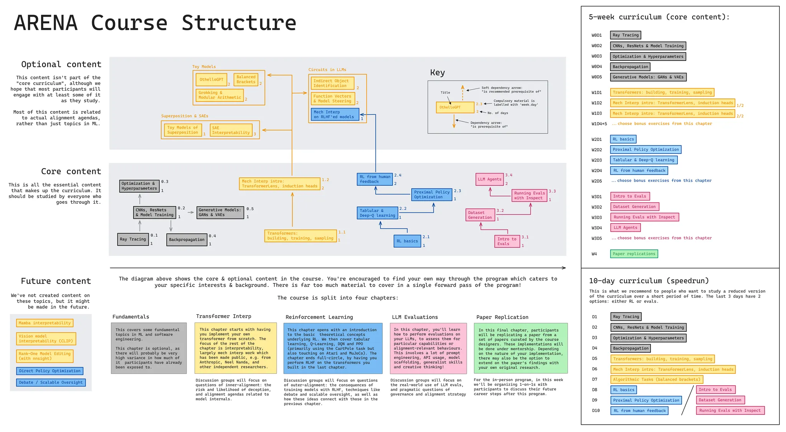
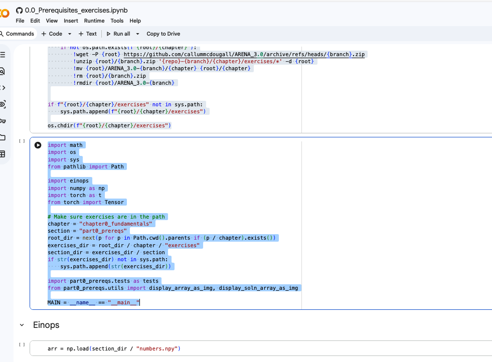

# Self-paced ARENA 3.0

Basic strategy is to always use rebase to keep your local main branch up to date with upstream main.

## How to set up your local repository:

1. Fork the repo on GitHub first (do this in browser)
    > Go to https://github.com/callummcdougall/ARENA_3.0 and click "Fork"

2. Make original repo as "upstream"
    > git remote add upstream https://github.com/callummcdougall/ARENA_3.0.git

3. Add your fork as "origin"
    > git remote add origin git@github.com:YOUR_USERNAME/ARENA_3.0.git

4. Push your main branch to your fork
    > git push -u origin main


## Daily Workflow

1. Fetch updates from upstream
    > git fetch upstream

2. Rebase updates into your local main branch
    > git checkout main
    > git rebase upstream/main

3. Push updates to your fork
    > git push origin main

## How to do solutions

In my case, my source solutions branch is `option2-python-vscode/solutions`.

Every other solution branch will branch out from this.

1. Create a new branch for the solution
    > git checkout -b option2-python-vscode/solutions-chap0-part0

2. Make your changes
    >  git commit -m "Add solution for chapter 0, part 0, prereqs"

3. Push your changes to your fork
    > git push origin option2-python-vscode/solutions-chap0-part0

## How to do own tooling

An example might be you prefer to use `uv` over `pip`

1. Create a new branch for the tooling from main
    > git checkout -b experiments/uv

2. Make your changes
    > git commit -m "Add uv as an alternative to pip"

3. Push your changes to your fork
    > git push origin experiments/uv


## Pdf of streamlit

Instead of opening the streamlit locally, I find it easier to just go to the hosted website at https://arena-chapter0-fundamentals.streamlit.app/ and keep a pdf copy in /pdf-of-streamlit

## How to choose your own adventure / path

At https://arena-resources.notion.site/ there's a map of the course in [excalidraw](https://app.excalidraw.com/l/9KwMnW35Xt8/8Krt4K7sxb3).



There's a speedrun option and there's clear indication of the various dependencies.

## Option chosen: Python file and VS Code

To access the course, there are 3 options given at https://arena-chapter0-fundamentals.streamlit.app/#how-to-access-the-course

I choose option 2: Python file and VS Code (also the strong recommendation for all in-person participants).

### Workflow for Each Part

1. **Open the Streamlit app** for the chapter you're working on:
   - Chapter 0: https://arena-chapter0-fundamentals.streamlit.app/

2. **Navigate to the exercises** by clicking on the part in the sidebar (e.g., "0️⃣ Prerequisites")
   - The Streamlit page contains explanations, examples, and exercise descriptions
   - Each exercise section has a Colab link for reference (open it to look at the exercise, but we won't use Colab to do the solutions)

3. **Create a `solutions.py` file** in the corresponding exercises folder:
   ```
   chapter0_fundamentals/exercises/part0_prereqs/xxx_solutions.py  # yours, e.g. kimsia_solutions.py this is mine
   ```

   

4. **Paste cell by cell from the Colab into your `solutions.py`**:
   ```python
    # %%

    import math
    import os
    import sys
    from pathlib import Path

    import einops
    import numpy as np
    import torch as t
    from torch import Tensor

    # Make sure exercises are in the path
    chapter = "chapter0_fundamentals"
    section = "part0_prereqs"
    root_dir = next(p for p in Path.cwd().parents if (p / chapter).exists())
    exercises_dir = root_dir / chapter / "exercises"
    section_dir = exercises_dir / section
    if str(exercises_dir) not in sys.path:
        sys.path.append(str(exercises_dir))

    import part0_prereqs.tests as tests
    from part0_prereqs.utils import display_array_as_img, display_soln_array_as_img

    MAIN = __name__ == "__main__"
   ```

   Note that I added `# %%` cell markers for VS Code's interactive Python features

5. **Make sure to copy paste the cells in order**

    

6. **Remember to include if MAIN**

    For direct calls to functions, remember to include if MAIN
    ```python
    # %%

    if MAIN:
        arr = np.load(section_dir / "numbers.npy")
    ```

    For function definitions, you need NOT wrap them inside `if MAIN`.
    ```python
    # %%
    def your_function():
        pass
    ```

    Always include `# %%` cell markers for VS Code's interactive Python features.

7. **Work through each exercise**:
   - Read the exercise description in Streamlit
   - Write your solution in `solutions.py`
   - Use `# %%` cell markers for VS Code's interactive Python features
   - Run tests to verify: `tests.test_einsum_trace(your_function)`

8. **Run your code** using VS Code:
   - `Shift+Enter` to run the current selection/line
   - Click "Run Cell" above any `# %%` marker

## Pacing

Given I am juggling work, and a part-time masters degree in Singapore Management University, taking this arena course is more of a upskilling exercise than a full course.

My priority rule is, **"Revenue > School > Upskilling"**.

### Concept Sprints

To minimize the [Zeigarnik Effect](https://www.psychologytoday.com/sg/basics/zeigarnik-effect), I break the course into atomic "Done" states called **Concept Sprints**.

| Phase | Content | Style |
|-------|---------|-------|
| Phase 1 | Fundamentals (0.0 → 0.4) | Sequential |
| Phase 2 | Transformer/Interp (1.1 → 1.2 → 1.5.1) | Sequential |
| Phase 3 | RL ↔ Evals | Interleaved |

**Key Rules:**
- Only work on Long Weekends / Breaks (no weeknights)
- Never open the next folder until current sprint is DONE
- 30-min refresher when switching tracks

👉 **Full sprint plan:** [sprint-plan.md](sprint-plan.md)


##