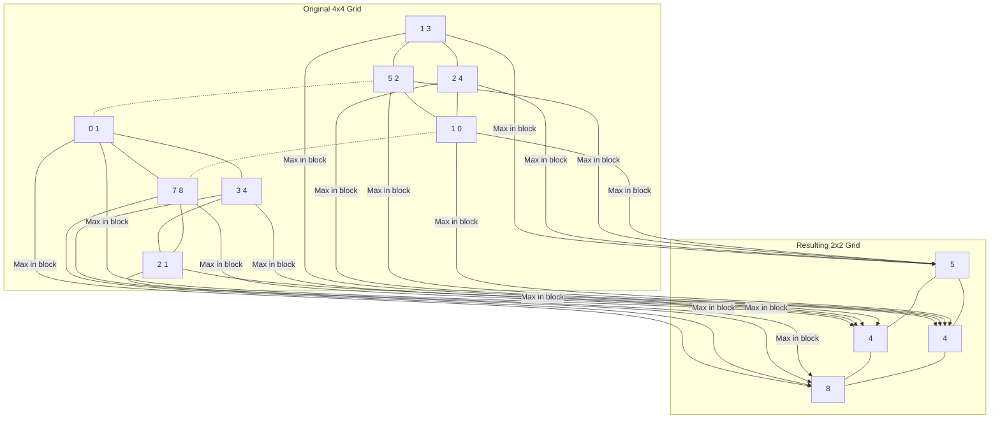

# Max Pooling with Einops

**Max Pooling** is a common downsampling operation in computer vision. It reduces the spatial dimensions (height and width) of an image while preserving the most important information (the maximum pixel values).

## What is Downsampling?

**Downsampling** is the process of reducing the resolution or size of data (like an image).

- **Why?** It makes computation faster, reduces memory usage, and helps the model focus on higher-level features rather than tiny, noisy details.
- **In images:** Moving from a 1000x1000 image to a 500x500 image is downsampling. You have fewer pixels, but the general "gist" of the image remains.
- **Common techniques:** Pooling (Max or Average) and Strided Convolutions.

## How it works (2x2 Max Pool)

1. **Divide** the image into non-overlapping 2x2 blocks of pixels.
2. **Select** the maximum value from each block.
3. **Create** a new image from these maximum values.

### The Loudspeaker Analogy

Imagine a crowded room divided into groups of 4 people. In each group, some people are whispering and one person is shouting.

**Max Pooling** is like choosing only the **shouter** to represent the entire group.

- **Why?** It preserves the most intense signal (the feature the model is looking for) while ignoring the lower-intensity background noise.

## Deep Dive: What is the "Signal"?

In the loudspeaker analogy, the signal is **volume**. But what is it in an image?

### 1. Simple Case: Pixel Brightness

In a basic grayscale image, the "signal" is simply **light intensity**. Max pooling preserves the brightest pixels. If you are looking for a white dot on a black background, max pooling ensures that white dot survives even as the image gets smaller.

### 2. Deep Learning Case: From RGB to Abstract Activations

In a neural network, the "pixels" in the middle layers aren't integers like `#FF0000` (Red or 255). Instead, they are usually **floating-point numbers** (e.g., `12.4`, `0.0`, `-3.1`).

#### Where do these numbers come from?

They are created by **Convolution Filters**. Imagine a 3x3 filter looking for a "vertical line":

1. **Math**: The filter slides over the raw RGB pixels and performs a mathematical operation (dot product).
2. **The "Score"**: If the underlying pixels look exactly like a vertical line, the result is a high positive number (e.g., `15.0`). If they look nothing like it, the result is zero or negative.
3. **The Activation Map**: The output is a new "image" where each "pixel" is actually a **Confidence Score** for that specific feature.

| Layer Type | What "Pixel" value means | Example Values |
| :--- | :--- | :--- |
| **Input Image** | Color Intensity (Raw) | `0 to 255` (Integer) |
| **Middle Layer** | Feature Confidence (Abstract) | `0.42`, `15.8`, `0.0` (Float) |

**Max Pooling** simply chooses the highest confidence score in a neighborhood. If one pixel says "I'm 90% sure there's an eye here" (represented by a high activation value like `1.2`) and others say "No eye here" (`0.1`), max pooling keeps the `1.2`.

### 3. Translation Invariance

This is the superpower of Max Pooling. It makes the model **translation invariant**. If a feature (like an eye or an edge) shifts by 1 pixel, the max value in the 2x2 block remains the same. The model's "conclusion" doesn't change just because the object moved slightly.

### Visual Mapping (4x4 to 2x2)



### Grid Comparison

```text
Original (4x4)           Max Pooled (2x2)
[[1, 3, 2, 4],           [[5, 4],
 [5, 2, 1, 0],    -->     [4, 8]]
 [0, 1, 7, 8],
 [3, 4, 2, 1]]
```

---

## Max vs Average Pooling

While **Max Pooling** grabs the "shouter", **Average Pooling** takes the average of the whole group.

- **Max Pooling**: Better for detecting sharp features (like edges) where you only need to know *if* a feature is present anywhere in the block.
- **Average Pooling**: Better for smoothing out noise but can "dillute" the signal if the feature is only in one pixel.

## Understanding the LHS: Dimensions as a "Factoring Machine"

The user implementation used this pattern: `(b1 b2) c (h 2) (w 2)`. This syntax is the secret sauce of `einops`.

### 1. Factorization (The "LHS" Rule)

When you write `(h 2)` on the LHS (Left Hand Side), you are telling `einops`:

> "Take my height dimension (say it's 150) and **factorize** it into a new dimension of `h` blocks, where each block has a size of `2`."

Mathematically: `150 = 75 x 2`.
So, `h` becomes `75`.

### 2. Grouping (How blocks are formed)

By writing both `(h 2)` and `(w 2)`, you have effectively reshapped the 2D image into a grid of **non-overlapping 2x2 squares**.

- The first `(h 2)` handles the vertical split.
- The second `(w 2)` handles the horizontal split.

Together, they "capture" 4 pixels into a temporary 2D block.

### 3. The Reduction (The "Missing 2" Rule)

Look carefully at the patterns:

- **LHS**: `... (h 2) (w 2)`
- **RHS**: `... h w`

Notice that the `2`s are **missing** from the RHS?

In `einops.reduce`, if a dimension exists on the LHS but is missing from the RHS, it is **reduced** (mathematically combined). Because we set `reduction="max"`, `einops` says:

> "I see a 2x2 block of 4 pixels here. Since you didn't ask for those 2x2 dimensions on the RHS, I will take the **maximum** of those 4 pixels and output just one value."

### 4. Important: The "Right-to-Left" Rule

In `(h 2)`, does it matter that `2` is on the right? **Yes.**

The order inside the parentheses determines how elements are grouped. For a deep dive on why we use `(h 2)` instead of `(2 h)`, see:
👉 **[Einops: The Golden Rule of Dimension Order](einops-dimension-order.md)**

### Summary

The `(h 2)` syntax is how you "zoom out". It groups adjacent elements together so you can operate on them as a single unit or "pool" them into a lower resolution.

---

## Implementing with `einops.reduce`

In `einops`, Max Pooling is a **reduction** operation. You use `einops.reduce` with the `'max'` operator.

### The Pattern

```python
einops.reduce(tensor, "c (h h_pool) (w w_pool) -> c h w", "max", h_pool=2, w_pool=2)
```

**Breaking down the patterns:**

- **LHS (Input): `c (h h_pool) (w w_pool)`**
  - `c`: Channels (RGB) remain unchanged.
  - `(h h_pool)`: We tell `einops` that the original height consists of `h` blocks, each of size `h_pool`.
  - `(w w_pool)`: Similarly, the width consists of `w` blocks, each of size `w_pool`.

- **RHS (Output): `c h w`**
  - We want the final image to have dimensions `h` and `w` (the number of blocks).

- **Operation: Choosing your operator**
  - Most often, we use **`"max"`** for Max Pooling.
  - For Average Pooling, we use **`"mean"`** (note: it's not `"avg"`).

> [!NOTE]
> For more details on supported operators and advanced usage, see the official **[einops.reduce API Documentation](https://einops.rocks/api/reduce/)**.

#### Common Operators

| Operator | Action | Pooling Type |
| :--- | :--- | :--- |
| **`"max"`** | Largest value | **Max Pooling** |
| **`"mean"`** | Average value | **Average Pooling** |
| **`"min"`** | Smallest value | Darkest pixel search |
| **`"sum"`** | Total sum | Global intensity |
| **`"prod"`** | Multiplication | Scaling factor check |

---

## The Big Picture: Designing a CNN

How do researchers decide how many layers or filters to use? While there is a lot of trial and error, there are a few **Golden Rules** (Heuristics):

### 1. The Pyramid Structure

As you go deeper into the network:

- **Spatial Resolution Decreases**: We use Max Pooling to make the image smaller (e.g., 224x224 -> 112x112 -> 56x56).
- **Number of Filters Increases**: We add more filters (e.g., 16 -> 32 -> 64 -> 128).

**Why?** Early layers look for simple things (edges), and there are only so many types of edges. Deeper layers look for complex things (eyes, faces, wheels), and there are thousands of possible high-level features. We need more "channels" (filters) to store that complexity.

### 2. Common Standards

Most modern CNNs follow a few standardized patterns:

- **Kernel Size**: Almost everyone uses **3x3** convolutions. It’s the "sweet spot" of efficiency and performance.
- **Layers**: Stacking many 3x3 layers is usually better than using fewer, larger layers (like 5x5 or 7x7).

### 3. Borrowing Success

Designing from scratch is hard! Most developers start with a **proven architecture** (a "backbone") like **ResNet** or **VGG**.

- If your task is simple (MNIST digits), you might only need 2-3 layers.
- If your task is complex (Self-driving cars), you might use 50-100+ layers.

---

## The "Black Box" Caveat: Learned vs. Programmed

You're absolutely right to be skeptical! We don't **program** filters to find "vertical edges" or "eyes."

### 1. Features are Discovered, Not Coded

The filter values begin as random noise. Through **Gradient Descent**, the model "stumbles" upon the fact that recognizing vertical edges is useful for predicting the label.

- The training process is **stochastic** (random). If you train the same model twice, the specific filters in the middle might look totally different.

### 2. Emerging Patterns

Despite being random/non-deterministic, we often see **convergent evolution**. Almost any model trained on natural images will "discover" edge detectors in its first few layers.

- Why? Because edges are the fundamental building blocks of almost everything in the physical world. The math forces the model to find them if it wants to be accurate.

### 3. Mechanistic Interpretability

The question of "what is this layer actually doing?" is one of the most active areas of AI research. It's called **Mechanistic Interpretability**.

- We use tools to peek inside and see what kind of patterns make a specific neuron "shout" the loudest.
- You'll find that while the *process* of learning is a black box, the *results* are often surprisingly logical and understandable.

---

> [!TIP]
> This course (ARENA) heavily focuses on **understanding the internals**. Later on, you'll learn tools to "read" these activations and prove what a specific circuit is doing!
