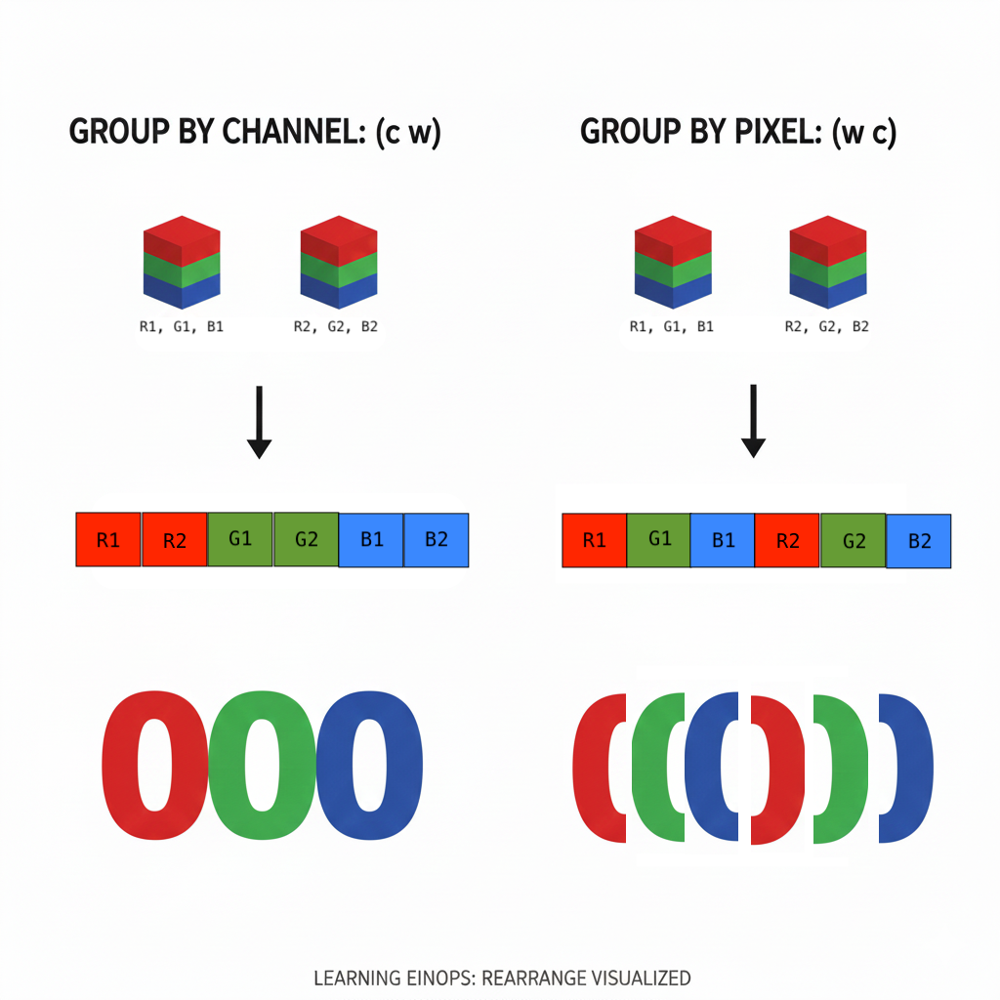

# Einops

**einops** (Einstein Operations) is a library that provides a readable, intuitive way to manipulate **tensor dimensions** using a string notation inspired by Einstein summation.

## What are tensor dimensions?

A **tensor** is just a multi-dimensional array. The **dimensions** (also called **axes**) describe the shape of that array:

| Dimensions | Name | Example |
|------------|------|---------|
| 0D | Scalar | `5` (just a number) |
| 1D | Vector | `[1, 2, 3]` — shape `(3,)` |
| 2D | Matrix | A spreadsheet or table — shape `(rows, cols)` |
| 3D | 3D Tensor | An RGB image — shape `(channels, height, width)` |
| 4D | 4D Tensor | A batch of RGB images — shape `(batch, channels, height, width)` |

**Real-world examples:**

| Data Type | Typical Shape | Dimensions Meaning |
|-----------|---------------|-------------------|
| Grayscale image | `(28, 28)` | height × width |
| RGB image | `(3, 224, 224)` | channels × height × width |
| Batch of images | `(32, 3, 224, 224)` | batch × channels × height × width |
| Text sequence | `(512,)` | sequence length (token IDs) |
| Batch of text | `(16, 512)` | batch × sequence length |
| Text embeddings | `(16, 512, 768)` | batch × sequence × embedding dimension |
| Attention weights | `(16, 8, 512, 512)` | batch × heads × query_seq × key_seq |

## The `rearrange` function

The most common operation is `einops.rearrange()`, which reshapes and reorders tensor dimensions.

**Syntax:**

```python
einops.rearrange(tensor, "input_pattern -> output_pattern")
```

## Example from the exercises

in 0.0_prereqs:

```python
arr_stacked = einops.rearrange(arr, "b c h w -> c h (b w)")
```

**Breaking it down:**

| Symbol | Meaning |
|--------|---------|
| `b` | batch dimension (number of images, e.g., 6 digit images) |
| `c` | channels (RGB = 3) |
| `h` | height (pixels) |
| `w` | width (pixels) |

**What the pattern does:**

1. **Input**: `b c h w` — a 4D array of shape `(6, 3, 28, 28)` (6 images, RGB, 28×28 pixels)
2. **Output**: `c h (b w)` — a 3D array of shape `(3, 28, 168)`. Note that 168 = 6*28 (6 images, 28 pixels wide)

The parentheses `(b w)` **merge** the batch and width dimensions together. This effectively places all 6 images side-by-side horizontally:

```
Before: 6 separate 28×28 images
After:  1 combined image that is 28×168 (28 height × 6×28 width)
```

## Why einops is useful

Traditional NumPy/PyTorch requires cryptic operations:

```python
# Hard to read
arr.transpose(1, 2, 0, 3).reshape(3, 28, -1)
```

Einops makes intent explicit:

```python
# Clear and readable
einops.rearrange(arr, "b c h w -> c h (b w)")
```

## Other common einops operations

| Operation | Purpose |
|-----------|---------|
| `rearrange` | Reshape, transpose, merge, or split dimensions |
| `reduce` | Aggregate over dimensions (mean, sum, max, etc.) |
| `repeat` | Tile/repeat tensor along dimensions |

## Text/Token examples (NLP)

### Token IDs to embeddings

```python
# 2 sentences, 4 tokens each (token IDs, not shown)
# Each token gets a 3-dimensional embedding
embeddings = [
    [[0.1, 0.2, 0.3],   # sentence 0, token "The"
     [0.4, 0.5, 0.6],   # sentence 0, token "cat"
     [0.7, 0.8, 0.9],   # sentence 0, token "sat"
     [1.0, 1.1, 1.2]],  # sentence 0, token "down"
    [[0.2, 0.3, 0.4],   # sentence 1, token "A"
     [0.5, 0.6, 0.7],   # sentence 1, token "dog"
     [0.8, 0.9, 1.0],   # sentence 1, token "ran"
     [1.1, 1.2, 1.3]]   # sentence 1, token "fast"
]  # shape (2, 4, 3) = (batch, seq_len, embed_dim)
```

### Averaging token embeddings (sentence embedding)

```python
# Get one vector per sentence by averaging all tokens
einops.reduce(embeddings, "b s d -> b d", "mean")

# Result: shape (2, 3)
[[0.55, 0.65, 0.75],   # avg embedding for "The cat sat down"
 [0.65, 0.75, 0.85]]   # avg embedding for "A dog ran fast"
```

### Splitting into attention heads

```python
# 1 sentence, 4 tokens, embed_dim=6 (will split into 2 heads × 3 dim)
x = [[[1, 2, 3, 4, 5, 6],      # "The"
      [7, 8, 9, 10, 11, 12],   # "quick"
      [13, 14, 15, 16, 17, 18], # "brown"
      [19, 20, 21, 22, 23, 24]]] # "fox"
# shape (1, 4, 6) = (batch, seq_len, embed_dim)

einops.rearrange(x, "b s (h d) -> b h s d", h=2)

# Result: shape (1, 2, 4, 3) = (batch, heads, seq_len, head_dim)
# Head 0 sees dims [0,1,2], Head 1 sees dims [3,4,5]
[[[[1, 2, 3],       # head 0: "The"
   [7, 8, 9],       # head 0: "quick"
   [13, 14, 15],    # head 0: "brown"
   [19, 20, 21]],   # head 0: "fox"
  [[4, 5, 6],       # head 1: "The"
   [10, 11, 12],    # head 1: "quick"
   [16, 17, 18],    # head 1: "brown"
   [22, 23, 24]]]]  # head 1: "fox"
```

### Attention scores: which tokens attend to which?

```python
# Attention weights: each token attends to all tokens
# shape (1, 2, 4, 4) = (batch, heads, query_seq, key_seq)
# Example: head 0's attention pattern
attn = [[[[0.7, 0.1, 0.1, 0.1],   # "The" attends mostly to itself
          [0.2, 0.5, 0.2, 0.1],   # "quick" attends to "The" and itself
          [0.1, 0.3, 0.4, 0.2],   # "brown" attends to "quick" and itself
          [0.1, 0.1, 0.2, 0.6]]]] # "fox" attends mostly to itself

# Average attention across heads
einops.reduce(attn, "b h q k -> b q k", "mean")
# Result: shape (1, 4, 4) — averaged attention pattern
```

### Repeating a positional encoding

```python
# Positional encoding for 4 positions, 3 dims
pos = [[0.0, 1.0, 0.0],
       [0.8, 0.6, 0.0],
       [0.9, -0.4, 0.0],
       [0.1, -1.0, 0.0]]  # shape (4, 3)

# Repeat for a batch of 2 sentences
einops.repeat(pos, "s d -> b s d", b=2)

# Result: shape (2, 4, 3) — same positions for each sentence
```

## More examples (with concrete data)

### 1. Transpose — swapping dimensions

```python
x = [[1, 2, 3],
     [4, 5, 6]]              # shape (2, 3)

einops.rearrange(x, "a b -> b a")

# Result:
[[1, 4],
 [2, 5],
 [3, 6]]                      # shape (3, 2)
```

### 2. Merge — combining dimensions into one

```python
x = [[[1, 2],
      [3, 4]],
     [[5, 6],
      [7, 8]]]                # shape (2, 2, 2) — think: 2 batches of 2×2 matrices

einops.rearrange(x, "b h w -> b (h w)")

# Result:
[[1, 2, 3, 4],
 [5, 6, 7, 8]]                # shape (2, 4) — flattened each 2×2 into length-4
```

### 3. Split / Decomposition

Splitting a single dimension into multiple components is a fundamental aspect of `einops`. To keep this guide focused, we've moved the detailed notes on **LHS vs RHS splitting** and **Decomposition logic** to a separate file:

👉 **[Einops: Decomposition (Splitting)](einops-split.md)**

```python
# Reverse of above: shape (1, 2, 2, 3) back to (1, 2, 6)
einops.rearrange(x, "b h s d -> b s (h d)")

# Result:
[[[1, 2, 3, 4, 5, 6],
  [7, 8, 9, 10, 11, 12]]]     # shape (1, 2, 6)
```

### 6. Flattening images for a linear layer

```python
# 1 image, 2 channels, 2×2 pixels
x = [[[[1, 2],
       [3, 4]],
      [[5, 6],
       [7, 8]]]]               # shape (1, 2, 2, 2)

einops.rearrange(x, "b c h w -> b (c h w)")

# Result:
[[1, 2, 3, 4, 5, 6, 7, 8]]    # shape (1, 8) — ready for nn.Linear
```

### 7. Reduce — aggregating over dimensions

```python
x = [[[1, 2],
      [3, 4]],
     [[5, 6],
      [7, 8]]]                 # shape (2, 2, 2)

# Mean over last dimension
einops.reduce(x, "b h w -> b h", "mean")
# Result: [[1.5, 3.5], [5.5, 7.5]]  # shape (2, 2)

# Max over batch dimension
einops.reduce(x, "b h w -> h w", "max")
# Result: [[5, 6], [7, 8]]          # shape (2, 2)
```

### 8. Repeat — duplicating along new dimensions

```python
x = [1, 2, 3]                  # shape (3,)

einops.repeat(x, "d -> b d", b=2)

# Result:
[[1, 2, 3],
 [1, 2, 3]]                    # shape (2, 3) — copied to 2 batches
```

### 9. Stretching vs Tiling (Order matters!)

When using `repeat`, the order of multiplication inside the output pattern changes the result dramatically:

```python
# arr[0] is one image of shape (3, 224, 224) -> (c, h, w)

# CASE 1: Tiling (repeating the pattern)
# "c (2 h) w" -> The '2' comes FIRST.
# Think: "Create 2 copies of the H dimension."
# Result: Two copies of the image stacked vertically.
tiled = einops.repeat(arr[0], "c h w -> c (2 h) w")

# CASE 2: Stretching (repeating the pixels)
# "c (h 2) w" -> The '2' comes LAST (inner loop).
# Think: "For each row h, repeat it 2 times."
# Result: The image is stretched vertically (pixel doubling).
stretched = einops.repeat(arr[0], "c h w -> c (h 2) w")
```


## Summary: Common patterns

| Pattern | What it does |
|---------|--------------|
| `a b -> b a` | Transpose |
| `(a b) -> a b` | Split a dimension |
| `a b -> (a b)` | Merge dimensions |
| `a b c -> a c` + `reduce` | Aggregate over `b` |
| `a b -> a b c` + `repeat` | Add new dimension `c` |

## Rearrange vs Repeat

A common source of confusion:

- **`rearrange`**: **Conservation of Volume**. The total number of elements must remain exactly the same. You are just shuffling them around.
  - `b c h w -> b (c h w)` (OK: $N \to N$)
  - `h w -> w h` (OK: $N \to N$)
- **`repeat`**: **Duplication**. You are creating *new* elements by copying existing ones. The total number of elements increases.
  - `h w -> h (2 w)` (Repeat: $N \to 2N$)
  - `h w -> (2 h) w` (Repeat: $N \to 2N$)

**Rule of thumb**: If the product of dimensions on the left != product of dimensions on the right, you probably need `repeat` (or `reduce`).

### Can `repeat` reduce dimensions?

Yes! `repeat` is powerful because it can perform **rearrangement (merging/flattening)** AND **repetition** in a single step.

Example from exercise (3):

```python
# Input: (2, 3, 28, 28) -> (b, c, h, w)
# Output: (3, 56, 56) -> (c, H_new, W_new)
einops.repeat(arr[0:2], "b c h w -> c (b h) (2 w)")
```

Here, we are doing two things at once:

1. **Reducing 4D to 3D**: Merging `b` and `h` into a single height dimension `(b h)`. (This is a rearrange operation).
2. **Repeating data**: `w` -> `(2 w)`. (This is a repeat operation).

### Common Pitfall: Unexpected identifiers (Left side vs Right side)

If you include a dimension on the left side (LHS) of `repeat` but forget to use it on the right side (RHS), you will get an error:

```
EinopsError: Unexpected identifiers on the left side of repeat: {'b'}
```

**Why?** `repeat` is for duplication or rearrangement, not reduction. It cannot simply "drop" a dimension like `b`. If you ignore `b` on the right side, einops doesn't know which of the `b` items to keep (or if it should sum them, average them, etc.).

**Example:**

```python
# Wrong: 'b' is on LHS but missing from RHS
# einops.repeat(arr[0:2], "b c h w -> c (2 h) (2 w)")
# >> Error: Unexpected identifiers on the left side of repeat: {'b'}
```

**Fix:** Ensure all LHS identifiers appear in the RHS pattern string somehow (even if merged into another dimension).

```python
# Correct: 'b' is used to multiply height
einops.repeat(arr[0:2], "b c h w -> c (b h) (2 w)")
```

If you *wanted* to get rid of `b` (e.g. by averaging), you should use `reduce` instead.

This is why `repeat` can look like it's "reducing" the number of dimensions (4D -> 3D) while actually increasing the number of elements.

### 11. Flattening Channels: Group by Channel vs Group by Pixel

When you have a 3-channel image (RGB) and you want to flatten it to 2D (height x width), the order of grouping determines whether you get "3 images side-by-side" or "1 stretched image".



#### Case 1: Group by Channel `(c w)` - "Side-by-Side"

**Pattern:** `c h w -> h (c w)`

This pattern iterates through **Channels** first (slowest inner loop), then completes the **Width**.

- It finishes all `w` pixels for Channel 0 (Red).
- Then all `w` pixels for Channel 1 (Green).
- Then all `w` pixels for Channel 2 (Blue).

**Result:**
`[Red Image Block] [Green Image Block] [Blue Image Block]`
Effectively splits the image into 3 replicas side-by-side.

#### Case 2: Group by Pixel `(w c)` - "Stretch"

**Pattern:** `c h w -> h (w c)`

This pattern iterates through **Width** first (slowest inner loop), then iterates through the **Channels** for that pixel.

- Pixel 1: `r1, g1, b1`
- Pixel 2: `r2, g2, b2`

**Result:**
`[r1 g1 b1 r2 g2 b2 ...]`
Effectively stretches the image horizontally by 3x.

- If the image is Grayscale (R=G=B), this looks like a perfect stretch.
-*   If the image is Color, this creates a "stripey" artifact pattern.

