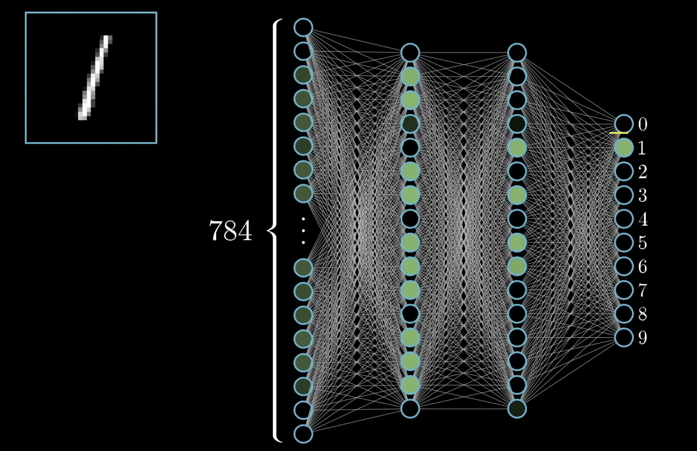
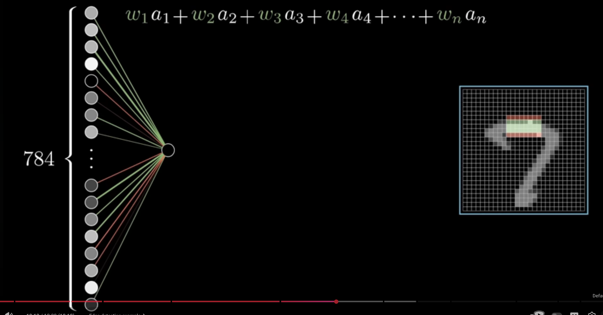

# Lookup

- Understand the structure and function of neural networks
- Learn essential linear algebra concepts like matrix operations and transformations
- Understand core principles of probability and statistics, including expected value and variance
- Learn how calculus concepts (particularly differentiation) are applied in optimization tasks
- Cover some foundational information theory concepts, such as entropy and KL divergence
- Enhance Python programming skills, focusing on NumPy and PyTorch basics

## Neural Networks

Classic example

- CNN -> good for image recognition
- LSTM -> good for time series, good for speech recognition
- Transformer -> good for NLP

Simplest NN = multi-layer perceptron

## What's a Neuron?

A thing that holds a number and does some math.

The number inside a neuron is called the activation.

For classic MNIST, 784 neurons correspond to a 28x28 pixel image.

[3Blue1Brown - But what is a neural network? | Chapter 1, Deep learning](https://www.youtube.com/watch?v=aircAruvnKk)

The last layer of 10 neurons represents the 10 possible digits.

Whenever we want to squish a range of numbers into something between 0 and 1, we use a sigmoid function.

To determine how neurons of 1 layer determine if a neuron of the next layer should activate, we use series of weights and the activation of the previous layer.

Sometimes you want the weighted sum to only activate the enxt neuron if it's above a number say 10.

so you add a bias term. THis is **bias for inactivity**.

Learning in this context is about finding the right weights and biases.

## Representing the Network Mathematically

**Scalar form** (for a single neuron):

$$
a_0^{(1)} = \sigma \left( w_{0,0} a_0^{(0)} + w_{0,1} a_1^{(0)} + \cdots + w_{0,k} a_k^{(0)} + b_0 \right)
$$

**Matrix form** (for all neurons in a layer):

$$
\begin{bmatrix}
a_0^{(1)} \\
a_1^{(1)} \\
\vdots \\
a_n^{(1)}
\end{bmatrix}
= \sigma \left(
\begin{bmatrix}
w_{0,0} & w_{0,1} & \cdots & w_{0,k} \\
w_{1,0} & w_{1,1} & \cdots & w_{1,k} \\
\vdots & \vdots & \ddots & \vdots \\
w_{n,0} & w_{n,1} & \cdots & w_{n,k}
\end{bmatrix}
\begin{bmatrix}
a_0^{(0)} \\
a_1^{(0)} \\
\vdots \\
a_k^{(0)}
\end{bmatrix}
+
\begin{bmatrix}
b_0 \\
b_1 \\
\vdots \\
b_n
\end{bmatrix}
\right)
$$

**Sigmoid function** (activation function that squishes values to 0-1):

$$
\sigma(x) = \frac{1}{1 + e^{-x}}
$$

**Where:**
- $a^{(l)}$ = activations (neuron values) at layer $l$
- $a^{(0)}$ = input layer activations (e.g., 784 pixel values for MNIST)
- $a^{(1)}$ = next layer activations after applying weights, biases, and sigmoid
- $W$ = weight matrix — each $w_{j,k}$ connects neuron $k$ in layer 0 to neuron $j$ in layer 1
- $b$ = bias vector — determines how easy it is for each neuron to activate
- $\sigma$ = activation function (sigmoid in this case) — applied element-wise
- $n$ = number of neurons in layer 1
- $k$ = number of neurons in layer 0 (input layer)

## WHy do we use ReLU?

Using sigmoid is old school.

Most networks use ReLU (Rectified Linear Unit) because it's easier to train.

$$ReLU  (x) = max(0, x)$$