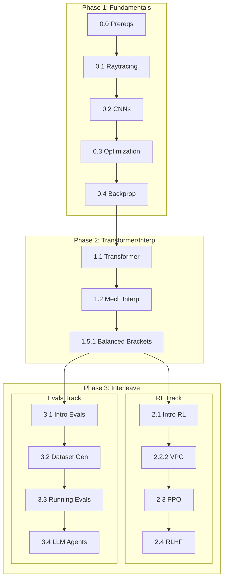

# Interleaved Sprint Plan for ARENA 3.0

- **Goal:** Cover Fundamentals → Transformer/Interp → Interleave RL & Evals
- **Strategy:** Sequential phases, with interleaving only in Phase 3
- **Career Alignment:** AI4SE (AI for Software Engineering) — practical applications
- **Target Orgs:** Anthropic, DeepMind, mixedbread, applied AI research labs

---

## Course Structure (Corrected)

After taking into consideration the speedrun recommended by the course and the dependencies in [map](map.png), I have restructured the course into the following phases:

```
Chapter 0: Fundamentals
├── 0.0 Prerequisites
├── 0.1 Ray Tracing                     ← SPEEDRUN
├── 0.2 CNNs                            ← SPEEDRUN
├── 0.3 Optimization                    ← SPEEDRUN
├── 0.4 Backprop                        ← SPEEDRUN
└── 0.5 VAEs (optional)

Chapter 1: Transformers & Mech Interp
├── 1.1 Transformer from Scratch        ← SPEEDRUN
├── 1.2 Intro to Mech Interp            ← SPEEDRUN
├── 1.3.1 Superposition & SAEs
├── 1.3.2 Interp with SAEs
├── 1.4.1 Indirect Object Identification
├── 1.4.2 Function Vectors & Steering
├── 1.5.1 Balanced Bracket Classifier   ← SPEEDRUN
├── 1.5.2 Grokking & Modular Arithmetic
└── 1.5.3 OthelloGPT

Chapter 2: RL
├── 2.1 Intro to RL                     ← SPEEDRUN
├── 2.2.1 DQN
├── 2.2.2 VPG
├── 2.3 PPO                             ← SPEEDRUN
└── 2.4 RLHF                            ← SPEEDRUN

Chapter 3: LLM Evals & Safety
├── 3.1 Intro to Evals                  ← SPEEDRUN
├── 3.2 Dataset Generation              ← SPEEDRUN
├── 3.3 Running Evals (with Inspect)    ← SPEEDRUN
└── 3.4 LLM Agents
```

---

## The 3-Phase Approach

```
┌─────────────────────────────────────────────────────────────┐
│  PHASE 1: FUNDAMENTALS (Sequential)                        │
│  0.0 → 0.1 → 0.2 → 0.3 → 0.4                               │
└─────────────────────────────────────────────────────────────┘
                            ↓
┌─────────────────────────────────────────────────────────────┐
│  PHASE 2: TRANSFORMER INTERP (Sequential)                │
│  1.1 → 1.2 → 1.5.1                                         │
└─────────────────────────────────────────────────────────────┘
                            ↓
┌─────────────────────────────────────────────────────────────┐
│  PHASE 3: INTERLEAVE RL ↔ EVALS (Variety Mode!)            │
│  RL 2.1 → Evals 3.1 → RL 2.2.2 → Evals 3.2 → ...            │
└─────────────────────────────────────────────────────────────┘
```

**Why this structure:**
- **Phase 1 & 2 are sequential** — dependencies flow naturally, no context switching
- **Phase 3 is interleaved** — RL and Evals are independent, so variety helps without breaking flow. See [How to Use Interleaving for Deeper Learning](https://www.coursera.org/articles/interleaving) for details.

---

## Phase 1: Fundamentals (Sprints 1-5)

Sequential, no interleaving. Build the foundation.

| Sprint | Part | Content | Done Criteria | Est. Time |
|--------|------|---------|---------------|-----------|
| 1 | `0.0` | Prerequisites | All tests pass | 2-3 hrs |
| 2 | `0.1` | Ray Tracing | All cells run, tensor ops understood | 4-6 hrs |
| 3 | `0.2` | CNNs | Trained a basic CNN | 4-6 hrs |
| 4 | `0.3` | Optimization | Understand SGD variants | 3-4 hrs |
| 5 | `0.4` | Backprop | Manual backprop works | 4-6 hrs |

**Checkpoint:** ✅ Ready for Chapter 1

---

## Phase 2: Transformer & Mech Interp (Sprints 6-8)

Sequential, no interleaving. Keep momentum in one domain.

| Sprint | Part | Content | AI4SE | Done Criteria |
|--------|------|---------|-------|---------------|
| 6 | `1.1` | Transformer from Scratch | ⭐⭐⭐ | Build GPT-2 small |
| 7 | `1.2` | Intro to Mech Interp | ⭐⭐ | Interpret attention patterns |
| 8 | `1.5.1` | Balanced Bracket Classifier | ⭐⭐ | Interpret algorithmic task |

**Checkpoint:** ✅ Ready for RL and Evals (independent tracks)

---

## Phase 3: Interleave RL ↔ Evals (Sprints 9+)

Now we interleave! Alternate between RL (R) and Evals (E) for variety.

| Sprint | Track | Part | Content | AI4SE | Done Criteria |
|--------|-------|------|---------|-------|---------------|
| 9 | R | `2.1` | Intro to RL | ⭐⭐ | Basic RL concepts |
| 10 | E | `3.1` | Intro to Evals | ⭐⭐⭐ | Understand eval frameworks |
| 11 | R | `2.2.2` | VPG (Vanilla Policy Gradient) | ⭐⭐⭐ | Policy gradient working |
| 12 | E | `3.2` | Dataset Generation | ⭐⭐⭐ | Create eval datasets |
| 13 | R | `2.3` | PPO | ⭐⭐⭐ | PPO agent training |
| 14 | E | `3.3` | Running Evals (Inspect) | ⭐⭐⭐ | End-to-end eval pipeline |
| 15 | R | `2.4` | RLHF | ⭐⭐⭐ | Understand RLHF pipeline |
| 16 | E | `3.4` | LLM Agents | ⭐⭐⭐ | Agent evals working |

**Legend:** R = RL, E = Evals

> [!TIP]
> **Sprints 13 (PPO) and 15 (RLHF)** are the foundation for understanding how Claude/GPT are trained. Combined with **Sprint 16 (LLM Agents)**, you'll have the full picture for AI4SE work.

---

## Sprint Rules (Anti-Zeigarnik)

1. **Never open the next folder until current sprint is DONE**
2. **Each sprint has a clear "Done Criteria"** — no ambiguity
3. **Weeknights banned** — only Long Weekends / Breaks
4. **30-min refresher** at start of each sprint when switching R ↔ E or when the last sprint was more than 2 weeks ago.
5. **If stuck > 1 hour:** Skip exercise, mark as "TODO-REVISIT", move on

---

## Refresher Protocol

When switching RL ↔ Evals or when the last sprint was more than 2 weeks ago:

```
[0:00-0:15] Review previous sprint's key concepts (skim notes)
[0:15-0:30] Re-run 1-2 key cells from previous sprint in that track
[0:30+]     Start new sprint
```

---

## Progress Tracker

### Phase 1: Fundamentals (Sequential)
- [ ] Sprint 1: `0.0 prereqs`
- [ ] Sprint 2: `0.1 raytracing`
- [ ] Sprint 3: `0.2 cnns`
- [ ] Sprint 4: `0.3 optimization`
- [ ] Sprint 5: `0.4 backprop`

### Phase 2: Transformer & Interp (Sequential)
- [ ] Sprint 6: `1.1 transformer from scratch`
- [ ] Sprint 7: `1.2 intro to mech interp`
- [ ] Sprint 8: `1.5.1 balanced bracket classifier`

### Phase 3: Interleave RL ↔ Evals
- [ ] Sprint 9: `2.1 intro to rl` (R)
- [ ] Sprint 10: `3.1 intro to evals` (E)
- [ ] Sprint 11: `2.2.2 vpg` (R)
- [ ] Sprint 12: `3.2 dataset generation` (E)
- [ ] Sprint 13: `2.3 ppo` (R)
- [ ] Sprint 14: `3.3 running evals` (E)
- [ ] Sprint 15: `2.4 rlhf` (R)
- [ ] Sprint 16: `3.4 llm agents` (E)

---

## Dependencies Visualization



---

## AI4SE Portfolio Building

| After Sprint | Portfolio Idea |
|--------------|----------------|
| `1.1` Transformer | "Building GPT-2 from Scratch" blog post |
| `1.5.1` Balanced Brackets | Analysis of how models learn algorithmic tasks |
| `3.3` Running Evals | Custom eval suite for a code generation task |
| `3.4` LLM Agents | Tool-use agent for coding tasks |
| `2.4` RLHF | RLHF tutorial focused on code generation |

> [!IMPORTANT]
> **For AI4SE roles at Anthropic/DeepMind:** The combination of **Evals (3.1-3.4)** + **RLHF (2.4)** is particularly valuable. Understanding how to evaluate AND train AI coding assistants is a rare skill set.

---

## Total Sprint Count

| Phase | Sprints | Content |
|-------|---------|---------|
| Phase 1 | 5 | Fundamentals |
| Phase 2 | 3 | Transformer/Interp |
| Phase 3 | 8 | RL ↔ Evals interleaved |
| **Total** | **16** | Complete speedrun path |

---

## When to Revisit This Plan

- After completing Phase 1 (verify Phase 2 readiness)
- After completing Phase 2 (verify interleaving still makes sense)
- After Sprint 12 (halfway through Phase 3)
- If a job opportunity arises (may need to prioritize Evals over RL)
